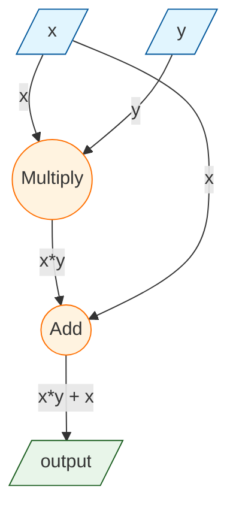
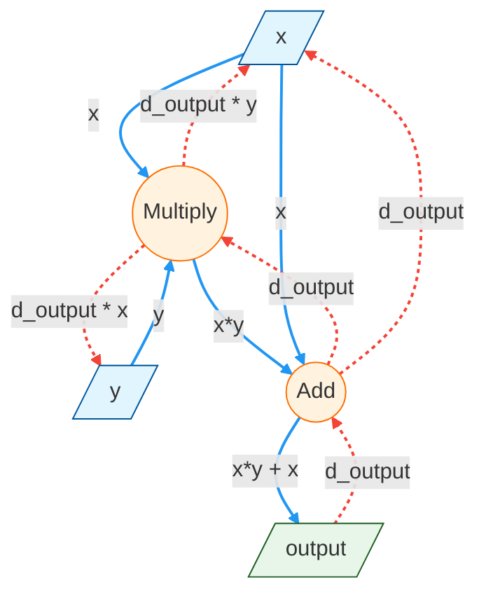

In Machine Learning Engineering (MLE), taught by Prof. Sasha Rush, I built [MiniTorch](https://minitorch.github.io/), a ground-up implementation of PyTorch. Starting from basis scalar operations, I implemented a fully operational Python library for training and using neural networks.

Getting to focus on the _engineering_ side of Machine Learning Engineering was super cool. Now, when I call `torch.nn.Linear` or `loss.backward()`, I know what's happening under the hood. These are my key takeaways! Note that I won't be discussing the fundamental theory behind ML (e.g. why we want to find the gradient of the loss function), as this blog focuses on the _why_ and _how_ of engineering ML code.

## Part 1: Fundamentals

<!-- First, we define some basic operators for scalar operations. As a simple example, we implement the ReLU function.

```python
def relu(x: float) -> float:
    """Compute the ReLU (Rectified Linear Unit) function."""
    return max(0.0, x)
```

Next, we consider how to implement a function that applies a scalar function to each element of an iterable. We do this by taking advantage of some functional programming: we define a `map` function that takes a function and returns a new function that applies the input function to each element of an iterable.

```python
def map(fn: Callable[[float], float]) -> Callable[[Iterable[float]], Iterable[float]]:
    """Apply a function to each element of an iterable.

    Args:
    ----
        fn: A function that takes a float and returns a float.

    Returns:
    -------
        A function that takes an iterable of floats and returns an iterable of floats
        with the input function applied to each element.

    """

    def inner(ls: Iterable[float]) -> Iterable[float]:
        return [fn(x) for x in ls]

    return inner
``` -->

Our goal is to implement code that allows us to train large neural networks. This requires keeping track of many parameters, as well as tracing operations to compute gradients.

We do this by using a `Module` building block that is maintained in a tree structure. Each module stores its own parameters, as well as its submodules.

Why a tree structure?

- Trees naturally represent hierarchical structures, which are common neural networks (layers building on top of each other)
- Trees allow us to easily represent parallel operations
- Components and their owned parameters are clearly defined, which is useful for debugging, memory management, gradient tracking etc.

For our base `Module` class, we define attributes

- `_modules`: Storage of the child modules
- `_parameters`: Storage of the module's parameters
- `training`: Whether the module is in training mode or evaluation mode

This class will also have functions to collect named parameters, submodules, etc. Another note:
we use magic methods to override the default behavior of Python, such as custom `getattr` and `setattr` methods. We also have a `__call__` method that invokes any forward method we define.

With this Module class, we can extend it to create our own custom modules. For example, we can create a `OtherModule` class that inherits from `Module`.

```python
class OtherModule(Module):
    def __init__(self):
        # Must initialize the super class!
        super().__init__()
        self.uncool_parameter = Parameter(60)


class MyModule(Module):
    def __init__(self):
        # Must initialize the super class!
        super().__init__()

        # Parameters.
        self.parameter1 = Parameter(15)
        self.cool_parameter = Parameter(50)

        # User data
        self.data = 25

        # Submodules
        self.sub_module_a = OtherModule()
        self.sub_module_b = OtherModule()
```

This is a simple toy example, but it illustrates how we might define useful modules like `Linear`, `Conv2d`, etc. In practice, this could look like a a ResNet module that contains convolutional and lienar submodules, with these submodules containing their own parameters (model weights).

## Part 2: Autodiff

The next part of the class is all about differentiation: how do we actually compute and store gradients for training?

One approach we can take is symbolic differentiation, where we explicitly find the mathematical expression for the gradient of the function (as we would do in calculus class). This makes sense for simple functions like $$ f(x) = x^2 $$, but becomes impractical for the more complex functions that would represent a neural network. Solving and storing such an expression explodes with model size.

Another approach is numerical differentiation, where we approximate the gradient by altering inputs slightly and observing the change in output. The issue here is a) numerical instability due to approximation errors and b) we would need to compute the gradient for each parameter. We can imagine that for contemporary models with billions of parameters, this is impractical.

To address these issues, automatic differentiation (autodiff) is the approach used in practice, which essentially collects information about every operation we perform in the forward pass, and uses this information to compute gradients in the backward pass. We can represent this collection and flow of information as a graph. I've seen nodes as functions and edges as values as well as the opposite; both perspectives are valid and the graph is simply a representation of how we organize the information.

With autodiff, we compute exact gradients like with symbolic differentiation, but we only need to evaluate each operation once (unlike numerical differentiation), since we store intermediate gradient accumulation values rather than entire expressions. Thus, autodiff is precise and scalable.

To do so in Python, we must override the default behavior of numbers and operators. To this end, we define proxy `Scalar` and `ScalarFunction` classes that allow us to remember what operators were used on what numbers.

Let's consider an example function f(x, y) = $$ x \* y + x $$





As an example, see how we define the multiplication operation. Note the usage of the context (ctx) variable to store values necessary for backpropagation:

```python
class Mul(ScalarFunction):
    @staticmethod
    def forward(ctx, x, y):
        ctx.save_for_backward(x, y)
        return x * y

    @staticmethod
    def backward(ctx, d):
        # Compute f'_x(x, y) * d, f'_y(x, y) * d
        x, y = ctx.saved_values
        f_x_prime = y
        f_y_prime = x
        return f_x_prime * d, f_y_prime * d
```

With this data saved, we can define a backpropagate function that actually computes the gradients. Note the usage of topological sort to obtain the order of operations. We also use the chain rule to calculate the gradients as we traverse the graph.

```python
def backpropagate(variable: Variable, deriv: Any) -> None:
    """Runs backpropagation on the computation graph in order to
    compute derivatives for the leave nodes.

    Args:
    ----
        variable: The right-most variable
        deriv  : Its derivative that we want to propagate backward to the leaves.

    Returns:
    -------
    No return. Should write to its results to the derivative values of each leaf through `accumulate_derivative`.

    """
    # Initialize a dictionary to store derivatives for each variable
    derivatives = {}

    # Perform topological sort
    sorted_variables = topological_sort(variable)
    derivatives[variable.unique_id] = deriv
    # Iterate through the sorted variables
    for var in sorted_variables:
        # Get the current derivative for this variable
        d_output = derivatives[var.unique_id]

        # If it's a leaf node, accumulate the derivative
        if var.is_leaf():
            var.accumulate_derivative(d_output)
        else:
            # Apply the chain rule to get derivatives for parent variables
            for parent, grad in var.chain_rule(d_output):
                if parent.unique_id not in derivatives:
                    derivatives[parent.unique_id] = grad
                else:
                    derivatives[parent.unique_id] += grad
```

## Part 3: Tensors

Data structures for storing and manipulating data.

## Part 4: Efficiency
